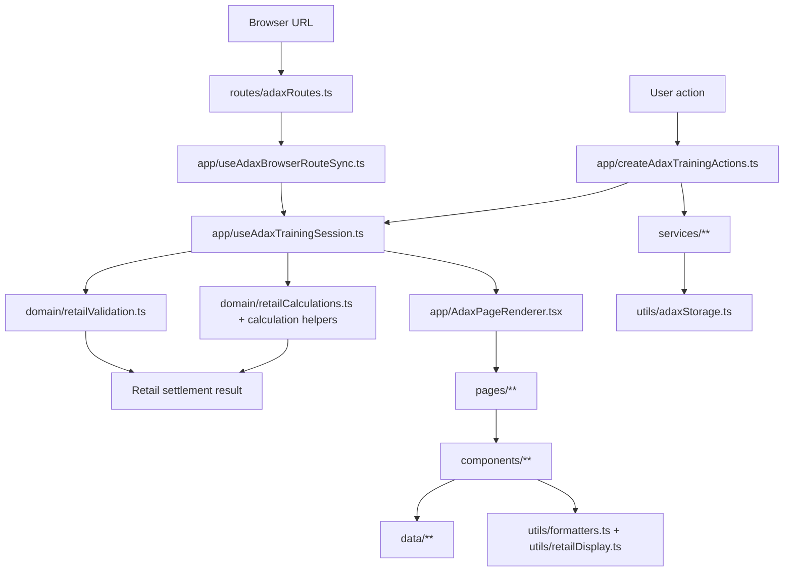

# ADAX Active Architecture Map

This map describes the current active ADAX v0.1 code path. It is meant to help future work stay maintainable before new participant workflows are added.

## Active Boundary

Active v0.1 is the local retail-company training flow:

- one unified virtual provincial market
- execution mode and review mode on the same chain
- 售电公司 as the only active operating participant
- browser localStorage for records and review materials
- local template import/export for retail execution state

The active app must not import from:

- `src/legacy/**`
- `single-html-prototype.html`
- `dist/**`
- external market APIs or real market-data files

## Runtime Flow



## Layer Responsibilities

### `src/App.tsx`

Application shell only.

Allowed:

- call `useAdaxTrainingSession`
- render `Layout`
- render `AdaxPageRenderer`

Not allowed:

- business rules
- page selection branches
- route-guard logic
- localStorage or template IO

### `src/app/**`

Application orchestration.

- `useAdaxTrainingSession.ts`: owns state composition and derived settlement/validation values.
- `adaxSessionDerivations.ts`: owns pure validation-gated settlement and flow-access-state derivations used by the session hook.
- `useAdaxBrowserRouteSync.ts`: owns browser URL, history, popstate, route normalization, and output-page route fallback.
- `adaxRouteSyncDecisions.ts`: owns pure output-route sync decisions that bridge flow guards and browser route effects.
- `createAdaxTrainingActions.ts`: owns user action handlers that coordinate state updates, records, review materials, and route writers.
- `createAdaxNavigationActions.ts`: owns page-navigation actions, flow fallback, and output-state route coordination.
- `AdaxPageRenderer.tsx`: owns page composition and page-level prop wiring.

Rules:

- browser history writes stay in `useAdaxBrowserRouteSync.ts`
- page navigation actions stay in `createAdaxNavigationActions.ts`
- training action implementations stay in `createAdaxTrainingActions.ts`
- page imports stay in `AdaxPageRenderer.tsx`
- `useAdaxTrainingSession.ts` should remain a composition hook
- app orchestration may call the retail calculation facade; React components should not bypass it by importing calculation helper modules directly

### `src/domain/**`

Pure business and flow logic.

Current modules:

- `retailTypes.ts`
- `retailState.ts`
- `retailExecutionChain.ts`
- `retailExecutionWorkbench.ts`
- `retailCustomerLoadDisplay.ts`
- `retailPackageDisplay.ts`
- `retailAnnualBilateralDisplay.ts`
- `retailMonthlyAuctionDisplay.ts`
- `retailValidation.ts`
- `retailCalculations.ts`
- `retailCalculationUtils.ts`
- `retailCustomerCalculations.ts`
- `retailRevenueCalculations.ts`
- `retailContractCalculations.ts`
- `retailExposureCalculations.ts`
- `retailRiskDiagnostics.ts`
- `retailMarketContext.ts`
- `retailNodeValidation.ts`
- `retailRecords.ts`
- `retailResultDisplay.ts`
- `retailSettlementDisplay.ts`
- `retailReviewMaterials.ts`
- `retailScenarioSamples.ts`
- `retailWorkbenchAssist.ts`
- `adaxModeBoundary.ts`
- `adaxModelBoundary.ts`
- `adaxRecords.ts`
- `adaxFlowGuards.ts`
- `adaxModeDecision.ts`
- `adaxNavigation.ts`

Allowed:

- pure functions
- type definitions
- calculation and validation rules
- flow and navigation decisions

Not allowed:

- React imports
- `window`, `document`, `localStorage`, `Blob`, or DOM APIs
- direct file import/export
- UI text layout decisions

Calculation helper rule:

- `retailCalculations.ts` is the compatibility facade for settlement and reviewed calculation exports.
- `retailCustomerCalculations.ts`, `retailRevenueCalculations.ts`, `retailContractCalculations.ts`, `retailExposureCalculations.ts`, `retailRiskDiagnostics.ts`, and `retailCalculationUtils.ts` are lower-level helpers.
- Components and pages must not import those lower-level helpers directly without first updating `scripts/check-boundaries.mjs` and documenting the exception.

### `src/data/**`

Virtual training data and static training-node definitions.

Current modules:

- `adaxScenarioMeta.ts`
- `adaxRoles.ts`
- `retailMarketData.ts`
- `retailCurves.ts`
- `retailTrainingNodes.ts`
- `retailReviewMaterials.ts`

Rules:

- data remains virtual and training-grade
- no real province, customer, declaration, transaction, or settlement data
- full 365-day/high-resolution data must not enter active UI without a domain model and tests

### `src/services/**`

IO-facing application services.

Current modules:

- `retailExecutionTemplates.ts`
- `adaxTrainingRecords.ts`
- `adaxTrainingRecordExports.ts`
- `adaxUserMaterials.ts`

Allowed:

- local template parsing and export preparation
- localStorage record/material coordination
- training-record export JSON preparation
- runtime validation before applying imported templates

Not allowed:

- React components
- settlement math
- real network APIs
- backend assumptions

### `src/utils/**`

Small shared helpers.

Current modules:

- `adaxStorage.ts`
- `download.ts`
- `formatters.ts`
- `retailDisplay.ts`

Rules:

- keep helpers narrow and UI-neutral when possible
- do not regrow broad business utility modules
- move business rules into `src/domain/**`

### `scripts/**`

Local engineering automation.

Path-level script inventory includes `scripts/check-engineering-guardrails.mjs` and the other scripts listed in `docs/ENGINEERING_BASELINE.md`.

Current scripts:

- `audit-source-shape.mjs`: reports active source line pressure, layer size, and import fan-in/fan-out hotspots.
- `check-engineering-guardrails.mjs`: fails quality when required engineering docs are disconnected, package quality scripts lose required commands/tests, Phase 5 candidate gates stop saying implementation is closed, or closed Phase 5 participant runtime files appear in active source.
- `check-domain-contracts.mjs`: fails quality when central domain/app contract exports, reviewed groups, or export order change without an explicit review update.
- `check-source-shape.mjs`: fails quality when new or already-budgeted large active files cross the source-shape budget without an audit update.
- `check-boundaries.mjs`: validates active source import, IO, network, data, and presentation-layer boundaries.
- `publish-pages.mjs`: runs the Pages release procedure for the current static preview.

Rules:

- scripts may coordinate local commands, file copying, release validation, and Git operations
- scripts must not contain ADAX business rules, settlement math, route logic, or UI behavior
- scripts must not import from `src/legacy/**`
- engineering guardrail checks may encode required governance files, cross-document references, package quality pipeline requirements, Phase 5 closed-gate phrases, and closed-candidate runtime file patterns; intentional changes require audit and test updates
- domain-contract checks may encode reviewed central exports from `src/domain/retailTypes.ts` and `src/types.ts`, but any changed export list, group, or order requires audit and test review
- boundary scripts may encode current allowed exceptions, but new exceptions require architecture review
- publishing scripts must keep `main` and `gh-pages` responsibilities separated

### `docs/**` and `AGENTS.md`

Project operating system and engineering guardrails.

Current entry and gate documents:

- `AGENTS.md`: required entry point for future ADAX coding work.
- `docs/ADAX_MVP_STARTER.md`: scope baseline.
- `docs/ADAX_LONG_TERM_PLAN.md`: autonomous execution roadmap.
- `docs/ENGINEERING_BASELINE.md`: maintainability baseline and risk register.
- `docs/ADAX_ENGINEERING_READINESS_AUDIT.md`: current engineering-hardening handoff baseline.
- `docs/ADAX_CHANGE_GATE_CHECKLIST.md`: pre-change classification, rescue gate, layer placement, and test selection.
- `docs/ADAX_PHASE_5_CANDIDATE_READINESS_AUDIT.md`: one-page Phase 5 candidate readiness gate; not implementation approval.
- `docs/ADAX_PHASE_5_ENTRY_GATE_REHEARSAL.md`: new-participant entry gate rehearsal before Phase 5 implementation.
- `docs/ADAX_PHASE_5_SCOPE_CONTROL_MATRIX.md`: side-by-side scope control for Phase 5 candidate participants.
- `docs/ADAX_PHASE_5_RENEWABLE_ENTRY_DRY_RUN.md`: renewable-specific entry dry run; not implementation approval.
- `docs/ADAX_PHASE_5_STORAGE_ENTRY_DRY_RUN.md`: independent-storage-specific entry dry run; not implementation approval.
- `docs/ADAX_PHASE_5_THERMAL_ENTRY_DRY_RUN.md`: thermal-specific entry dry run; not implementation approval.
- `docs/ADAX_RENEWABLE_STARTUP_CARD.md`, `docs/ADAX_INDEPENDENT_STORAGE_STARTUP_CARD.md`, and `docs/ADAX_THERMAL_STARTUP_CARD.md`: pending participant startup cards; not implementation approval.
- `docs/ADAX_RETAIL_CONTRACT_GOVERNANCE.md`: central retail/app contract groups, change rules, and split triggers.
- `docs/ADAX_SOURCE_SHAPE_AUDIT.md`: source size and import hotspot audit for refactor prioritization.
- `docs/ADAX_RELEASE_PROCESS.md`: Pages publishing process.

Rules:

- update these documents when source boundaries, phase order, release flow, or guardrail rules change
- do not use docs to justify hidden scope expansion; update the startup card first
- keep checklists short enough to be usable before each change
- stale docs must be corrected before continuing feature work

### `src/styles/**`

Responsibility-based CSS partitions imported from `src/styles.css`.

Current high-level split:

- base and app shell styles, with app shell split into grid/sidebar shell, sidebar collapse control, sidebar brand/market mark, sidebar mode card, collapsed-state visibility overrides, sidebar navigation container, navigation item states, status dots, footer notice, collapsed navigation layout, and topbar
- home/about/records/flow page styles, with home split into shell/hero/actions/flow-card/shared-rows/section-heading/mode-card/market/records/boundary partitions, about split into shell/hero/panel/section/meaning/list partitions, records split into shell/empty/cards/field-rows/detail/boundary, mode flow split into base/decision/confirmation/path/records, role flow split into cards/details/ecosystem/info-pack/seat-summary, scenario flow split into shell/market/activity/confirmation, shared flow rows split into data-list/step-list/side-helper partitions, and step indicator styles isolated from inactive workspace-context styles
- cockpit base, summary, layout, form controls, action buttons, template actions, template field guides, panels, mode-card, comparison/event, feedback, notice, and message surface styles
- retail shell, node rail, operation head/content, execution context, assist entry, grid primitives, market board/load/price/months/briefs, trade base/reference/form-grid/card/choice-card/field-status/input/control/feedback, result base/status/boundary/state/hint/snapshot/settlement/board layout/map/bar/row/empty/verdict/insight/diagnostic, review prompt/material/progress, and shared side-action styles
- responsive rules split by desktop/tablet/mobile/narrow breakpoints, with mobile shell, sidebar, topbar, result status, page, grid, workspace, flow, and market sub-surfaces separated

Rules:

- keep `src/styles.css` as the ordered import entry
- preserve import order when splitting CSS to avoid visual regressions
- split large CSS files by surface responsibility, not by arbitrary line count
- do not place behavior, business rules, or generated CSS output in this layer

### `src/pages/**`

High-level page composition.

Current pages:

- `AboutPage.tsx`
- `HomePage.tsx`
- `ModeSelectionPage.tsx`
- `ScenarioPage.tsx`
- `RolePage.tsx`
- `WorkspacePage.tsx`
- `RecordsPage.tsx`

Rules:

- pages may compose components and pass callbacks
- pages may present active data
- pages must not own settlement math, template parsing, or route guards
- `RecordsPage.tsx` coordinates records state and actions; archive list, detail panel, empty state, and export JSON preparation live in components/services
- mobile sidebar collapse and shell-level responsive navigation stay in `Layout.tsx` and app-layout styles, not individual pages
- `Layout.tsx` owns only shell collapsed-state coordination and app-frame assembly; sidebar, topbar, and brand mark rendering live in `src/components/layout/**`

### `src/components/**`

Reusable UI and retail work surfaces.

Rules:

- components should render controls, panels, charts, and local UI states
- complex transaction validation belongs in domain modules
- execution/review layout should stay structurally aligned where they represent the same node chain
- `RetailMarketSituationBoard.tsx` renders the shared market context for scenario and retail workspace pages; market context derivation stays in `src/domain/retailMarketContext.ts`
- `RetailSettlementSignalBoard.tsx` renders shared exposure and settlement result signals across workspace, settlement, and execution result-review surfaces; exposure/cost-stack display interpretation stays in `src/domain/retailSettlementDisplay.ts`
- execution workspace node context, status, input/output artifact counts, and next-action labels stay in `src/domain/retailExecutionWorkbench.ts`; `RetailExecutionWorkspace.tsx` renders that contract
- execution workspace active-node validation mapping stays in `src/domain/retailNodeValidation.ts`; `RetailExecutionWorkspace.tsx` uses the result instead of owning validator routing
- execution workspace chrome is split into `RetailExecutionContextBar.tsx` and `RetailExecutionNodeFooter.tsx`; `RetailExecutionWorkspace.tsx` remains a composition surface
- customer load node segment progress, customer mix, available capacity, and status copy stay in `src/domain/retailCustomerLoadDisplay.ts`; `RetailCustomerLoadNode.tsx` renders that contract in a primary-action plus reference-feedback layout
- retail package node option list, price text, selected package feedback, and status copy stay in `src/domain/retailPackageDisplay.ts`; `RetailPackageNode.tsx` renders that contract in the same primary-action plus reference-feedback layout
- annual bilateral node deal tone, completion count, reference bounds, and status copy stay in `src/domain/retailAnnualBilateralDisplay.ts`; `RetailAnnualBilateralNode.tsx` renders that contract in a primary-action plus reference-feedback layout
- monthly auction node window progress, participation counts, window status, and reference ranges stay in `src/domain/retailMonthlyAuctionDisplay.ts`; `RetailMonthlyAuctionNode.tsx` renders that contract in the same primary-action plus reference-feedback layout
- mobile retail workspace ordering is a responsive layout concern: current operation panel comes before result feedback and node rail so the active market/operation board is not buried below navigation
- retail execution action nodes are split by node: package, annual bilateral, and monthly auction
- retail review is split into workspace composition, material grid, and output panel
- records archive, detail, and empty-state rendering live in `src/components/records/**`; `RecordsPage.tsx` remains a composition surface
- app shell sidebar, topbar, and market-clearing brand mark live in `src/components/layout/**`; navigation decisions remain in `src/domain/adaxNavigation.ts`

## Active Data Flow

1. `routeFromLocation` reads current browser URL into `{ page, mode, role }`.
2. `pathForPage` only emits the active `retailer` participant while Phase 5 remains closed, even if a closed participant id is passed in.
3. `useAdaxBrowserRouteSync` keeps route state, legacy merged product paths, participant query params, and guarded output URLs synchronized.
4. `useAdaxTrainingSession` composes React state and derives validation/settlement.
5. `createAdaxTrainingActions` updates state, records, materials, and routes in response to user actions.
6. Retail validation and settlement come from `src/domain/**`.
7. Records and review materials persist through `src/services/**` and `src/utils/adaxStorage.ts`.
8. `AdaxPageRenderer` renders the active page and passes only the needed props.

## Import Rules

Preferred direction:

```text
App
  -> app
  -> pages
  -> components

app
  -> domain/routes/services/utils/data

pages/components
  -> domain/data/services/utils

services
  -> domain/data/utils

domain
  -> domain types only
```

Forbidden:

- `src/domain/**` importing React, services, browser APIs, pages, or components
- active code importing `src/legacy/**`
- React components importing old prototype data packages
- pages/components writing browser history directly
- calculation logic placed inside React components

## Test Coverage Map

Current no-dependency domain tests live in `tests/domain/retail-domain.test.mjs`.

App-layer action tests live in `tests/app/*.test.mjs`.

Shared test fixtures live in `tests/support/*.mjs`.

Script-level guardrail tests live in `tests/scripts/*.test.mjs`.

Covered:

- retail state validation
- retail execution chain continuity
- retail settlement calculation
- 100% total volume coverage still producing hourly curve mismatch, positive/negative exposure, and risk adjustment
- execution-mode result display contract without formula-heavy copy
- shared model-boundary copy for financial-looking training outputs
- annual bilateral coverage bounds, counterparty-floor rejection/acceptance, selected curve preservation, and invalid annual template rejection
- monthly auction windows, explicit participation decisions, coverage bounds, curve selection, opt-out zero calculation, hidden skipped-field rejection, and invalid monthly template rejection
- market situation context for annual boundary, three monthly windows, and three 24-hour typical-day curves
- settlement display hierarchy for result signals, exposure signals, and cost-stack items
- execution workspace context contract for node status and next action
- execution active-node validation mapping
- customer load display contract for segment progress and mix status
- retail package display contract for option status and price text
- annual bilateral display contract for primary action status and counterparty feedback
- monthly auction display contract for window progress and status
- retail execution template round trip and invalid import rejection
- execution record snapshot, localStorage filtering, latest-20 cap, and saved-record revisit target
- review material scope, invalid material filtering, empty-save blocking, review record snapshot, and review revisit target
- training-record export JSON boundary and batch export count
- reviewed `retailTypes.ts` and `src/types.ts` export groups and order through `npm run check:domain-contracts`
- domain-contract checker negative fixtures for unreviewed, reordered, and missing central exports
- source-shape checker negative fixtures for unbudgeted large files and budgeted file growth
- review-mode vs execution-result-review boundary
- route helpers
- route-sync decisions
- output-route sync decisions for settlement viewed marking, blocked execution outputs, review-mode output blocking, and no-mode fallback
- session derivations for validation-gated settlement, calculation exception fallback, and flow access state
- shared retail/browser test fixtures for complete retail state, local records/materials, and fake browser storage setup
- flow guards
- navigation shell rules
- app-layer navigation action side effects for product-route reset and review-output guarding
- app-layer training action decisions for mode reset, execution result/save guards, and node-bound review material saves
- boundary-checker negative fixtures for component validation imports, domain browser APIs, and real province runtime data

Next useful coverage:

- app test harness extraction if action tests add more stateful scenarios
- browser visual QA for professional market immersion changes

## Current Risk

The biggest remaining active risk entering Phase 5 is scope expansion without a startup card. New participant workflows must not enter active code until scope, data, rules, UI contracts, and tests are explicitly defined.
